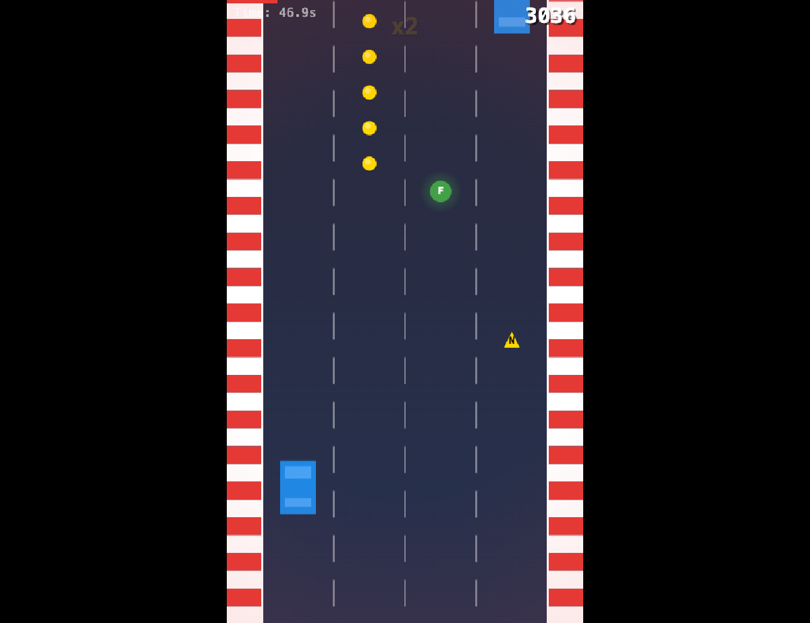

# Road Rush

Um jogo de corrida endless runner desenvolvido com JavaScript puro e Canvas API.



## Como jogar

- **Setas ← →** ou **A / D** — mover o carro entre as faixas
- Desvie do tráfego, colete combustível e acumule pontos
- A velocidade aumenta progressivamente — sobreviva o máximo possível!

## Mecânicas

| Elemento | Descrição |
|----------|-----------|
| 🚗 Tráfego | Carros normais e agressivos surgem com frequência crescente |
| ⛽ Combustível | Colete os itens verdes para reabastecer — sem combustível, game over |
| 💰 Moedas | Colete as moedas amarelas para bônus de pontuação |
| ⚡ Nitro | Acelera o carro e concede invulnerabilidade temporária |
| 🛡️ Escudo | Protege de uma colisão |
| 🔥 Near Miss | Passe raspando em carros para multiplicar seu combo |
| 🏆 Survivor Bonus | +300 pontos a cada 30s sem colisão |

## Dificuldade progressiva

O jogo tem duas fases de aceleração:
- **Fase 1** (até 600 px/s): velocidade sobe gradualmente com o tempo
- **Fase 2** (600–800 px/s): aceleração ainda mais intensa por tick

O tráfego fica mais denso e agressivo conforme a corrida avança.

## Tecnologias

- JavaScript (ES Modules)
- Canvas API
- Vite (build/dev server)

## Executar localmente

```bash
npm install
npm run dev
```

Abra `http://localhost:5173` no navegador.
